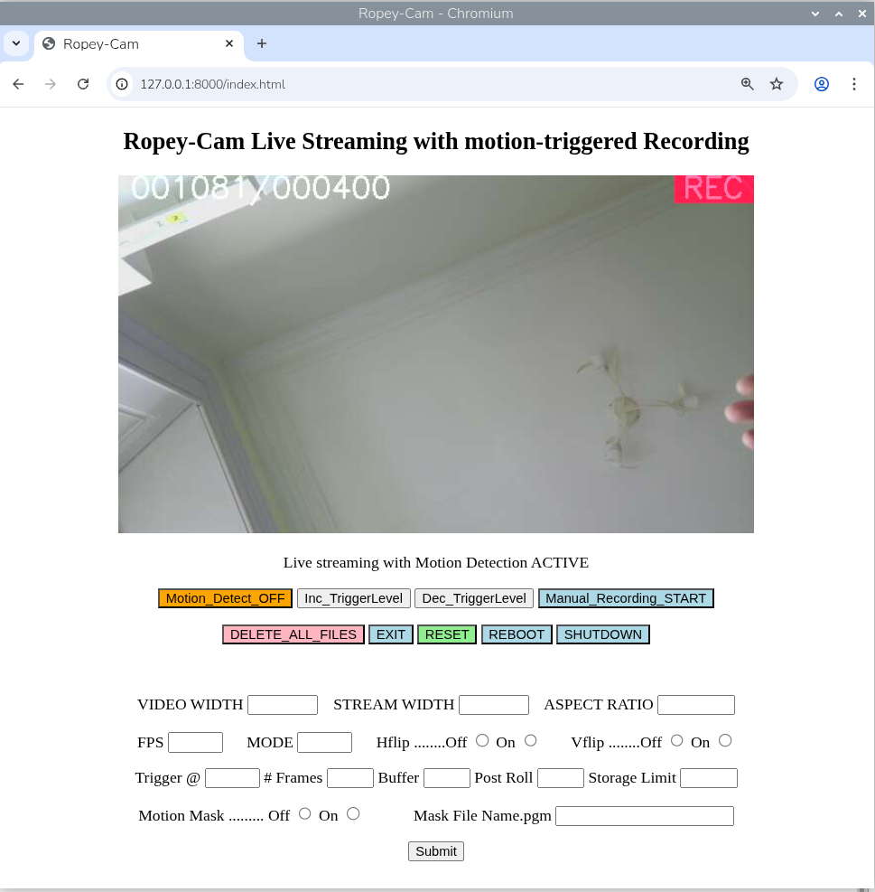
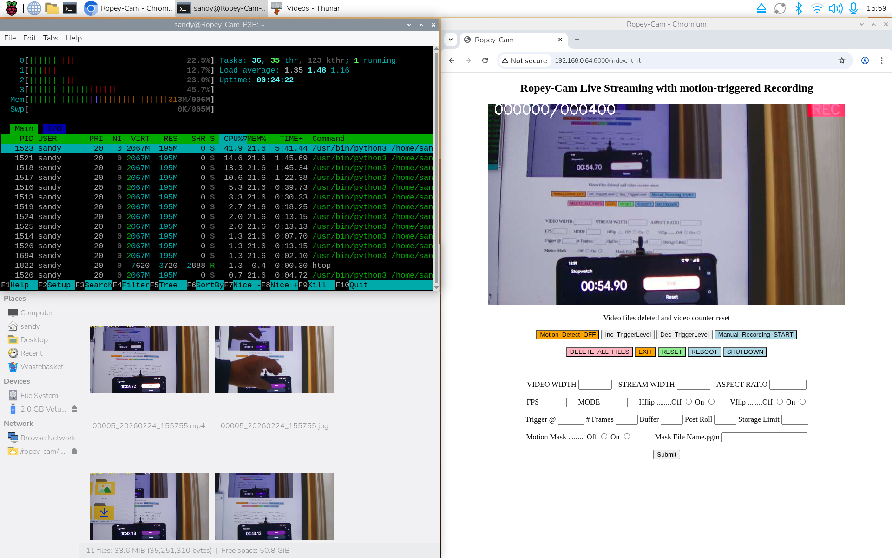

### Ropey-Cam is a Python-based surveillance camera system, designed for Raspberry Pi single-board computers with attached camera modules. The system provides real-time, low-latency, MJPEG video streaming to web browsers, while simultaneously monitoring for motion, and recording high-quality H.264/.mp4 video clips when motion is detected.

As a long term user of the comprehensive [RPi_Cam_Web_Interface](https://github.com/silvanmelchior/RPi_Cam_Web_Interface) with various RPi cameras (V1,V2 and HQ), it was frustrating not being able to use third party cameras or any of the later RPi camera modules with RCWI. Unable to find any libcamera/Picamera2 based alternatives, and as a learning exercise, work started on a basic -*very basic*- alternative.

For those looking for more comprehensive features, the very fully featured [raspi-cam-srv](https://github.com/signag/raspi-cam-srv) is recommended.

"Ropey-Cam" reflects its construction methodology: it is assembled from code snippets and examples from the Picamera2 repository, with minimal Python complexity, and uses a multi-threaded architecture to handle concurrent operations. In it's basic form, when installed on a RPi with the standard desktop OS, the only additional dependency is OpenCV.

### Quick Start Example
 
On a Raspberry Pi running a desktop RPiOS and with camera attached, open a terminal and enter :-

`hostname -I`

and take a note of the Raspberry Pi's IP address.

Then :-

	sudo apt install python3-opencv -y
	git clone https://github.com/sandyol55/Ropey-Cam
	cd Ropey-Cam
	./Ropey-Cam.py

#### Alternatively
*The only file required is the python script Ropey-Cam.py. So instead of cloning the whole repository, simply open the file and copy or download it and install it on a Ropey-Cam directory on the target local machine. Then proceed to run the file as above.*

To access the camera stream and controls :-

From another device on the same network browse to xxx.xxx.x.xxx:8000, where xxx.xxx.x.xxx is the IP address of the Ropey-Cam Raspberry PI.

Or, on the Raspberry Pi computer, open a local browser and request 127.0.0.1:8000  -  or even do both - to get simultaneous streams to multiple browsers.

The browser should present a home page as below

---

### Basic operation.

The figures in the top left of the streaming video frame indicate the measure of frame to frame change in the video, against the currently set trigger level. If motion (or noise) in the video is present, in excess of the trigger level, then video  recording will be activated as indicated by the red REC stamp in the top right.

To reduce the likelihood of triggering by transient events, or noise, a configurable number of consecutive frames exceeding the change trigger level are required before recording is activated. The default is currently set to 5.

If recording is activated when no apparent motion is present in the video, pressing the Inc_TriggerLevel button repeatedly will increase the frame to frame change threshold  at which recording is triggered.

Similarly if motion in the frame does not trigger recording press the Dec_TriggerLevel button repeatedly until recording is triggered. 

Once calibrated for the motion/noise environment, test that deliberate motion triggers recording.

The REC stamp will remain for ~ 6 seconds after motion has dropped below the trigger level, while the full video file - containing ~3 seconds pre-trigger, N seconds of motion and ~3 seconds of post-motion video - is saved to disk.

This recording is happening in the background while the live stream continues uninterrupted. 

### Control buttons
Brief description of the effect of the control buttons, some of which may be familiar to Rpi_Cam_Web_Interface users ;-)

**Motion_Detect_Off**
>  will disable the motion detection, but retain the live stream.

> will be replaced by Motion_Detect_On

**Inc_ and Dec_TriggerLevel**
>as described above, modify the sensitivity to motion

**Manual_Recording_Start**
> will initiate a recording irrespective of motion triggering.

>will be replaced by Manual_Recording_Stop.

**DELETE_ALL_FILES**
> will delete all the timestamped .mp4 video and associated trigger-point .jpg files that are stored in the Videos subdirectory.

> Requires to be confirmed with a second press.

**EXIT**
> will end the Ropey-Cam program on the Raspberry Pi,

>also requires confirmation with a second press.

**RESET**
>acts as a cancel button for any of the 4 other system buttons,

> to allow the first press of those buttons to be ignored and reset. 

**REBOOT**
>will reboot the Raspberry Pi. 

>Best used in an advanced set-up where Ropey-Cam has been set to 
start on boot up.

**SHUTDOWN**
> will shutdown the Raspberry Pi.

> Like EXIT and REBOOT there is a built in delay of ~ 8 seconds, to allow any in-progress recordings to be stored cleanly.

---

### Pre-deployment configuration

Typical use is expected to be in a headless remote mode.

Before deploying it will be useful to examine the code and, if necessary, make changes to match the Pi and camera being used,  e.g.

>  To select the aspect ratio of the sensor being used.

> To select the resolution of the main video recording stream and the browser stream

> To select the required framerate

> And to select the mode in which to operate the sensor.

These are controlled by documented commented lines within the code at lines 67-87, line 89 and line 136. 

Edit as required.

The default configuration is currently :-

16:9 output with a 1280x720 main stream resolution and 640x360 for the browser stream, and a framerate of 20 fps.

The sensor default mode is set to 1, which will typically give a full frame (16:9) 2x2 binned mode on HQ and V3 cameras, or a full frame (4:3) 2x2 binned mode on V1 or V2 cameras. 

Other recommended steps before deploying are:-

> set the Raspberry Pi up as a Samba server  

> set the Ropey-Cam program to start on boot, with a systemd service.

> (Lots of online tutorials for these steps, but links to guides for creating  both of these services are included at the bottom of this page).

---

### Performance

As an example the screenshot below is taken from a Pi5, accessing Ropey-Cam running on a Pi3 Model B V1.2, with both machines connected via Wi-Fi to a home network.

In the upper left is an ssh session running htop on the remote Pi3 during an active recording, indicating useful spare CPU and memory capacity.

In the lower left the Thunar file manager is accessing the Videos subdirectory on the remote Pi3 via the network samba share. (Using a separate file manager from the inbuilt pcmanfm allows the thumbnail icon sizes to be increased without affecting the desktop).

And on the right is the browser, showing an image from the camera while it is being pointed at the browsing computer's screen - with a stopwatch in the foreground.

The difference between the stopwatch time in the foreground, and the background - earlier - image of the stopwatch that has been captured, processed, passed through the network to the browser and displayed, is a measure of the system latency.  The latency of 150ms is in the low range of the values seen in this particular configuration, which were typically in the 150 to 190 ms range. 

### Acknowledgements 

Much of the code is taken from the examples, discussions and responses to issues as found in the [Picamera2 Github repository](https://github.com/raspberrypi/picamera2) .
 
The method of button control was inspired by [this article](https://github.com/e-tinkers/simple_httpserver/blob/master/README.md) .
 
And [signag](https://github.com/signag/raspi-cam-srv) offered coding suggestions against an early version of the code. 

The previous simple mse frame to frame change algorithm has been replaced by a more effective 'Frame Difference' algorithm based on [this article](https://medium.com/@itberrios6/introduction-to-motion-detection-part-1-e031b0bb9bb2)

### To Do

Update this README, the screenshots and the General Notes, to reflect the latest additions of :-

 A configuration .ini file.
 
 New browser input elements which allow the main configuration features to be updated without requiring hard-coded script changes. 
 
 [Lite Installation](docs/lite.md)
 
 [Samba share](docs/samba.md)
 
 [Start on reboot](docs/start_on_boot.md)
 
 [General Notes](docs/general_notes.md)