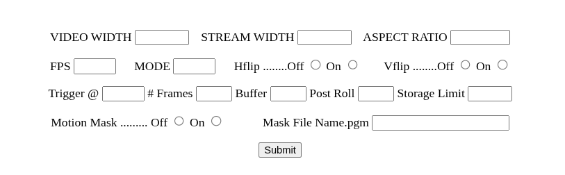

## General notes to help modify the application for specific uses.

### Compatibility with Raspberry Pi models and cameras.
With the exception of the original single core CPU boards, i.e.the Raspberry Pi Model A/B and the Pi Zero, all models from Zero 2W through Pi 2 to Pi 5 have sufficient resources to run Ropey-Cam (R-C). Best results at the highest resolutions and framerates will need Pi4 and above.

As R-C is based on Picamera2/libcamera it should be compatible with all Raspberry Pi camera modules V1, V2, V3, HQ and GS, any third party versions of these, and any colour camera modules that have supported drivers in the Raspberry Pi kernel eg IMX290 IMX462. 

#### Video sizes and FrameRates
The default configuration is 1280x720 @ 20fps for the recorded video, and 640x360 (at the same framerate) for the stream to the browser and is conservative and 'should just work' on any supported combination of Pi + Camera module.

Full HD 1920x1080 at 30 fps for the recorded video is best with Pi 4 and above, although Full HD @ 20fps has been tested successfully on a Pi3A+.
 
In 4:3 (1.333) aspect ratio the max recommended VIDEO WIDTH is 1600 pixels giving a 1600x1200 frame size.

## Description of configuration entry inputs
----
 

---
When first run R-C will read in the configuration file ropey.ini and apply the values to the relevant application constants and variables. These values can be updated using the input fields, either with individual entries or in any combination followed by a press of the Submit button. 
### Configuration Fields

#### VIDEO WIDTH
The VIDEO WIDTH field will accept values from 1024 to 1920 in steps of 32 pixels, to match the optimal alignments supported by the hardware, and controls the pixel width of the recorded .mp4 video files.
#### STREAM WIDTH 
The STREAM WIDTH will accept values from 512 to 1280 in steps of 128 pixels to match all Pi model hardware alignments. (Earlier models supported steps of 64 pixels, but 128 is required for Pi 5).
#### ASPECT RATIO
The ASPECT RATIO can be either 1.333 , 1.777 or 2.221  (4:3 , 16:9  or 20:9), and is used to calculate the relevant HEIGHT for each stream.  (No sensor modes support native 20:9 but the system will readily crop a 16:9 mode and give a wide format 20:9 video output or stream).  
#### FPS
The framerate FPS can be set between 10 and 30 fps in steps of 5.
#### MODE
The MODE selects one of the fundamental operating modes of the camera;
those shown when queried with  `rpicam-hello --list-cameras`

Typically MODE 0 will give a cropped and binned low resolution mode.

MODE 1 will give:-

 a full-frame 2x2 binned 16:9 mode on HQ and V3 camera modules 
 
 a full frame 2x2 binned 4:3 mode on V1 and V2 camera modules
 
Mode 2 will give a full-frame 2x2 binned 4:3 mode on an HQ module.

Other higher modes may be useful in limited circumstances.
#### Hflip Vflip
The Hflip and Vflip switches can be used to vertically or horizontally mirror the video frame or invert it if used together. Applies to both recorded and streaming frames. 
### Trigger @
After testing the application in the intended environment and finding the optimum trigger_level with the Inc/Dec controls it may be easier to input the trigger-level for motion detection value directly, particularly if large changes are needed.

### # Frames
To help ensure the triggering is caused by 'true motion' the current default setting of AFTER # FRAMES is to wait for 5 consecutive frames with a 'Frame Difference' above the trigger_level, before activating recording.
 

### Buffer and Post-roll 
The current default of buffer_seconds is set to 3 seconds, and controls the length of the circular buffer that is capturing frames from before the trigger moment. Longer values are possible, but will increase the memory requirements.

### Post Roll
The post-roll is also set to a default 3 seconds and can be altered to capture more or less video following the cessation of motion.

### Storage Limit

To help avoid the disk/card running out of storage space the disk_usage is checked after each video file is stored and if the ratio of used/total space exceeds this limit the oldest files will be deleted.

The default is 80% (0.8) A value closer to 1.0 may be useful with lower capacity storage cards. Lower values may be appropriate for large capacity cards. 
    
## Configuration storage
Configuration changes are stored internally after being submitted or entered, but are not applied 'on-the-fly'. The changes are written to the configuration ropey.ini file on EXIT/SHUTDOWN or REBOOT, and will take effect when the file is read on the next startup.

## Timestamps
The recorded video files have a date and time stamp embedded in the frame data. The time includes a millisecond record and is useful for checking for dropped frames.  By single-stepping through the recorded files the millisecond counter should advance by ~ 1000 / FRAMES_PER_SECOND each frame. A jump between frames of more than this would indicated dropped frames in the encoded video file.  Playing back the files using mpv media player, rather than the default vlc, can be useful with it's more flexible forward/backward single stepping and easier access to the video properties information.  