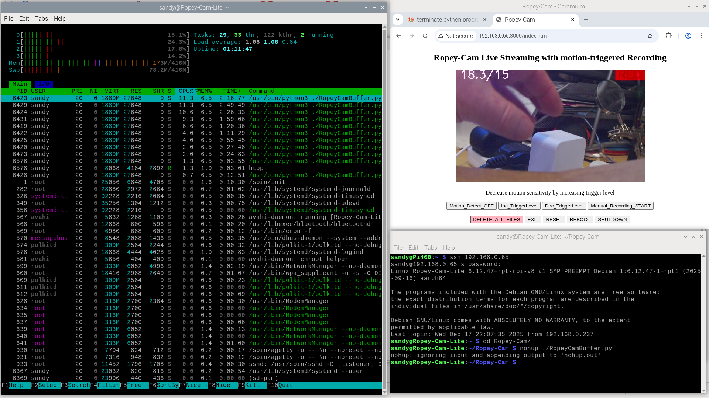

## Instructions to configure a Lite installation
Although a full RPiOS is recommended for all Pi variants, if using a Pi Zero2W or 3A+ you may want to run on a Lite installation, to have a bit more memory 'headroom'.

>Flash a new 64bit Lite image to a card, with SSH configured.

>Insert card into the Pi with a connected camera module.

>Power on and *wait* until the full image installation and reboot sequences are complete. (Could take up to 15 minutes with a slow SD card! )

>SSH in to the Pi and :-

`sudo apt update && sudo apt full-upgrade -y`

`sudo apt install python3-picamera2 --no-install-recommends -y`

`sudo apt install python3-opencv -y`

`sudo apt install git -y`

`git clone https://github.com/sandyol55/Ropey-Cam`

`cd Ropey-Cam`

`./Ropey-Cam.py`

Then continue as per the main page documentation to point a browser at the Raspberry Pi. (Wait about 10-15 seconds to allow all the libraries to load and for the camera to be initialised).

At this point you should see the image from the camera in the browser page and messages about the status in the terminal window.

Note that closing the terminal window will signal the program to hang up at which point the server will no longer be accessible.

To allow the terminal to be closed, while leaving the server running use :-

`nohup ./Ropey-Cam.py`

Or, to avoid the console and error messages filling up the nohup output log :-

`nohup ./Ropey-Cam.py >/dev/null 2>&1`

## Resources

A screenshot from a Pi5 browser accessing Ropey-Cam.py running on  Pi3A+,  with two ssh sessions attached, one with htop running and a second running Ropey-Cam, along with a samba share connected  - shows markedly lower memory usage than the 'Desktop' version running on a Pi3B that was shown in the main page.

The latency in this case was ~200ms but was much more consistent than the Desktop version. This consistency *may* be due to the lower overall CPU usage under the Lite OS?

